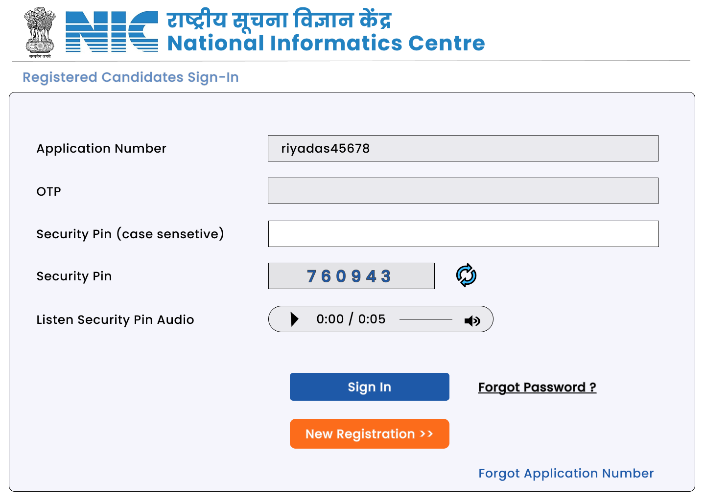
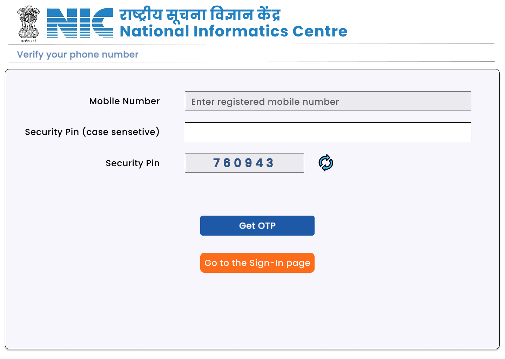
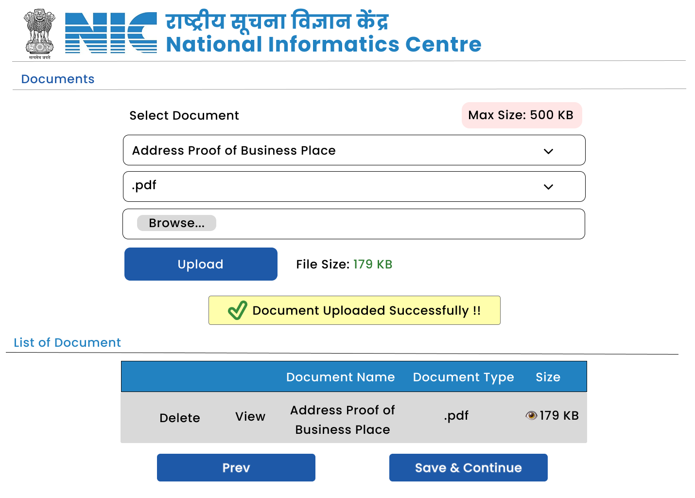
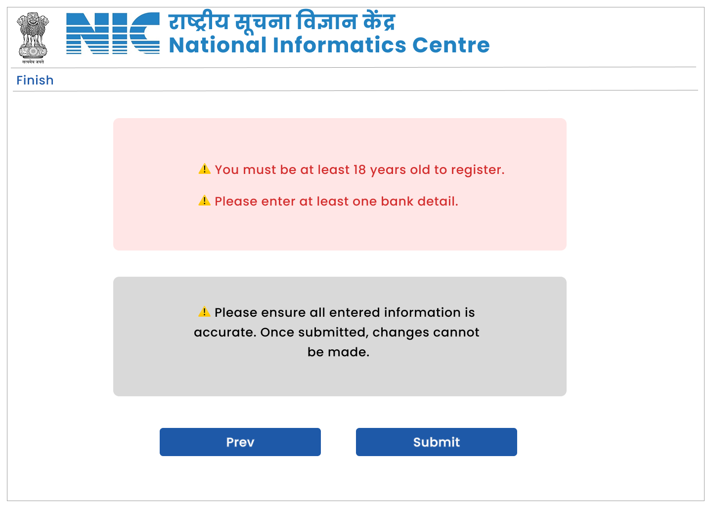

# 🏛️ NIC VAT Registration Portal

<div align="center">


**राष्ट्रीय सूचना विज्ञान केंद्र | National Informatics Centre**

A modern, user-friendly web application for Value Added Tax (VAT) registration in Tripura, India.

[](https://reactjs.org/)
[](https://getbootstrap.com/)
[](https://reactrouter.com/)

</div>
---

## 📖 Table of Contents

- [Overview](#-overview)
- [Features](#-features)
- [Screenshots](#-screenshots)
- [Tech Stack](#-tech-stack)
- [Project Structure](#-project-structure)
- [Getting Started](#-getting-started)
- [Registration Workflow](#-registration-workflow)
- [API Integration](#-api-integration)
- [UI/UX Design](#-uiux-design)
- [Troubleshooting](#-troubleshooting)
- [Contributing](#-contributing)
- [Learn More](#-learn-more)

---

## 🎯 Overview

The **NIC VAT Registration Portal** is a comprehensive frontend application developed for the **National Informatics Centre (NIC)** to digitize and streamline the VAT registration process in Tripura. This project transforms the traditional paper-based system into a modern, efficient, and accessible digital platform.

### Key Objectives

- 🚀 **Modernize Registration**: Replace manual, paper-based processes with digital workflows
- ✅ **Ensure Data Accuracy**: Real-time validation and guided forms reduce errors
- 🔒 **Secure Processing**: JWT-based authentication and secure document handling
- 📱 **Accessible Anywhere**: Responsive design works on desktop, tablet, and mobile
- ⚡ **Improve Efficiency**: Multi-step guided process saves time for both users and officials

### Core Functionalities

* **Guided Multi-Step Registration**: Users navigate through structured forms (Part A, Part B, Part C, Bank Info, Additional Business Places, Partner Details, Document Upload) ensuring systematic and accurate data collection
* **Secure Document Management**: Upload and manage all essential supporting documents with validation and size checks
* **User Authentication & Session Management**: Secure login, password recovery, and persistent sessions using JWT tokens stored in localStorage
* **Real-time Client-Side Validation**: Instant feedback on form inputs with pattern matching, required field checks, and data format validation
* **Responsive Bootstrap 5 UI**: Consistent, accessible, and mobile-friendly interface with NIC branding

---

## ✨ Features

### 🔐 Authentication Module

| Feature | Description | Status |
|---------|-------------|--------|
| **Sign In** | Secure authentication using Application Number, Password, and Captcha verification | ✅ Implemented |
| **Forgot ID** | Recover user Application ID via registered email/phone | 🚧 Planned |
| **Forgot Password** | Secure password reset mechanism with OTP verification | 🚧 Planned |
| **Session Management** | JWT token-based persistent sessions with auto-logout | ✅ Implemented |

### 📝 Multi-Step Registration Workflow

<div align="center">

```
Home → Part A → Part B → Part C → Bank Info → Additional Places → Partners → Documents → Finish
```

</div>

| Step | Form Name | Purpose | Key Fields |
|------|-----------|---------|------------|
| 1️⃣ | **Home Page** | Welcome & navigation | Landing page with instructions |
| 2️⃣ | **Part A Form** | Core business details | Registration type, Applicant name, PAN, Trading name, Principal address, Contact details |
| 3️⃣ | **Part B Form** | Address & economic activity | Residential address, Economic activity code, Commodity details, Business nature |
| 4️⃣ | **Part C Form** | Regulatory information | Sales figures, Tax declarations, Import/Export details, Certificate uploads |
| 5️⃣ | **Bank Info** | Banking details | Multiple bank accounts with IFSC, Account number, Branch details |
| 6️⃣ | **Additional Business Places** | Secondary locations | Address details for all additional business premises |
| 7️⃣ | **Partner Details** | Partnership information | Comprehensive partner data for non-proprietary businesses |
| 8️⃣ | **Document Upload** | Supporting documents | PAN card, Address proof, ID proof, Registration certificates |
| 9️⃣ | **Finish** | Submission confirmation | Application summary and acknowledgment receipt |

### 🎨 User Interface & Experience

- ✅ **Responsive Design**: Bootstrap 5-based mobile-first approach
- ✅ **Accessibility**: WCAG compliant with keyboard navigation support
- ✅ **Reusable Components**: Modular architecture with shared components
- ✅ **Loading States**: Visual feedback during API calls with `LoadingButton`
- ✅ **Success Messages**: Clear confirmation dialogs with `SuccessMessage`
- ✅ **Captcha Support**: Audio captcha with `SpeakCaptcha` for accessibility
- ✅ **NIC Branding**: Official NIC and Government of India logos and color scheme

### 🔧 Technical Features

- **Stateful Navigation**: React Router DOM 7 with protected routes and navigation guards
- **Form State Management**: React hooks (useState, useEffect) for complex form handling
- **Client-Side Validation**: 
  - Required field validation
  - Pattern matching (PAN, PIN code, mobile numbers)
  - File type and size validation
  - Date range validation
- **API Integration**: Axios-based HTTP client with interceptors for token management
- **Error Handling**: Comprehensive error boundaries and user-friendly error messages
- **Data Persistence**: LocalStorage for session management and application state

---

## � Screenshots

### Home Page


### Sign In


### Verification


### Part A Form


### Part B Form


### Part C Form


### Bank Information


### Additional Business Places


### Business Partner Details


### Document Upload


### Finish


### Forgot Password


### Forgot UGAAC ID


---

## �🛠️ Tech Stack

<div align="center">

| Category | Technology | Version | Purpose |
|----------|-----------|---------|---------|
| **Core** | React | 19.1.0 | UI component library |
| **Routing** | React Router DOM | 7.6.2 | Client-side navigation & routing |
| **Styling** | Bootstrap | 5.3.7 | Responsive CSS framework |
| **Icons** | Bootstrap Icons | 1.13.1 | SVG icon library |
| **HTTP Client** | Axios | 1.10.0 | API communication |
| **Build Tool** | Create React App | 5.0.1 | Development & build configuration |
| **Package Manager** | npm | 8.x+ | Dependency management |
| **Runtime** | Node.js | 16.x+ | JavaScript runtime |

</div>

### Why These Technologies?

- **React 19**: Latest stable version with improved performance, automatic batching, and better concurrent features
- **React Router DOM 7**: Modern routing with data loading, actions, and nested routes
- **Bootstrap 5**: Industry-standard responsive framework, no jQuery dependency
- **Axios**: Promise-based HTTP client with interceptors for token management and error handling
- **Create React App**: Zero-config setup with webpack, Babel, ESLint pre-configured

---

## 📁 Project Structure

```
NIC-VAT-Registration/
│
├── public/                          # Static assets
│   ├── index.html                  # HTML template
│   ├── manifest.json               # PWA manifest
│   ├── robots.txt                  # SEO configuration
│   ├── OIP.png                     # Ashoka Emblem
│   └── nic.png                     # NIC logo
│
├── src/                            # Source files
│   ├── App.js                      # Root component with routing
│   ├── index.js                    # Application entry point
│   ├── index.css                   # Global styles
│   │
│   ├── components/                 # Reusable components
│   │   ├── Header.js              # NIC header with logos
│   │   ├── Footer.js              # Application footer
│   │   ├── LoadingButton.js       # Button with loading state
│   │   ├── SuccessMessage.js      # Success notification component
│   │   ├── CustomTable.js         # Dynamic table component
│   │   ├── GeneratePinInput.js    # PIN code input field
│   │   └── SpeakCaptcha.js        # Audio captcha component
│   │
│   ├── pages/                      # Page components (routes)
│   │   ├── Home.js                # Landing page
│   │   ├── SignIn.js              # Authentication page
│   │   ├── ForgotPassword.js      # Password recovery
│   │   ├── ForgotId.js            # ID recovery
│   │   ├── PartAForm.js           # Registration Part A
│   │   ├── PartBForm.js           # Registration Part B
│   │   ├── PartCForm.js           # Registration Part C
│   │   ├── BankInfo.js            # Bank details form
│   │   ├── AdditionalBusinessPlaces.js  # Additional locations
│   │   ├── businessPartnerDetails.js    # Partner information
│   │   ├── DocumentUpload.js      # Document submission
│   │   └── Finish.js              # Completion page
│   │
│   └── constants/                  # Static data
│       └── dropDowns.js           # Dropdown options (districts, offices, etc.)
│
├── build/                          # Production build (generated)
│   ├── static/                    # Optimized assets
│   │   ├── css/                   # Minified CSS
│   │   ├── js/                    # Minified JavaScript bundles
│   │   └── media/                 # Optimized images
│   ├── index.html                 # Production HTML
│   └── asset-manifest.json        # Build manifest
│
├── package.json                    # Dependencies & scripts
├── package-lock.json              # Locked dependency versions
└── README.md                      # This file
```

### Component Architecture

```
App
│
├── Router
    ├── Home
    ├── SignIn
    ├── Registration Flow
    │   ├── Part A (with Header, Footer, LoadingButton)
    │   ├── Part B (with Header, Footer, CustomTable)
    │   ├── Part C (with Header, Footer, SuccessMessage)
    │   ├── Bank Info (with Header, Footer, CustomTable)
    │   ├── Additional Places (with Header, Footer, CustomTable)
    │   ├── Partner Details (with Header, Footer, CustomTable)
    │   └── Document Upload (with Header, Footer)
    └── Finish
```

---

## Technologies Used

The frontend application is built using a modern stack to ensure performance, maintainability, and a rich user experience:

* **React Router DOM 7:** For efficient client-side routing and navigation.
* **React 19:** A declarative, component-based JavaScript library for building user interfaces.
* **Bootstrap 5:** A powerful, responsive, mobile-first frontend toolkit for styling and layout.
* **Bootstrap Icons:** A collection of high-quality SVG icons. 
* **Axios:** A promise-based HTTP client for making API requests to the backend.
* **Create React App:** For bootstrapping the React development environment. 

---

## 🖼 UI/UX Design

The user interface and experience are designed with a focus on simplicity, responsiveness, and accessibility:

* **Wireframes:** Based on detailed [VAT Frontend WireFrames available on Figma](https://www.figma.com/design/DxvLsJbcMhVJkoP4x3n7pc/NIC-VAT-Registration?m=auto&t=TNs2BzidBiDDgfuC-1), ensuring a consistent design language and navigation flow.
* **Styling:** Utilizes [Bootstrap 5](https://getbootstrap.com/) for a modern, clean, and consistent look and feel across all components and pages.

---

## 🚀 Getting Started

Follow these steps to set up and run the NIC VAT Registration Portal on your local machine.

### Prerequisites

Before you begin, ensure you have the following installed:

- **Node.js** (version 16.x or higher) - [Download Node.js](https://nodejs.org/)
- **npm** (version 8.x or higher) - Comes with Node.js
- **Git** (optional, for version control) - [Download Git](https://git-scm.com/)

Check your installed versions:

```bash
node --version  # Should output v16.x.x or higher
npm --version   # Should output 8.x.x or higher
```

```bash
node --version  # Should output v16.x.x or higher
npm --version   # Should output 8.x.x or higher
```

### Quick Start

1.  **Clone the repository** (if not already downloaded):

    ```bash
    git clone https://github.com/sp201004/NIC-VAT-Registration.git
    cd NIC-VAT-Registration
    ```

    *Or if you have the project downloaded, navigate to the project directory.*

2.  **Install all dependencies**:

    ```bash
    npm install
    ```

    This will install all packages listed in `package.json` including React, React Router, Bootstrap, Axios, and other dependencies.

3.  **Start the development server**:

    ```bash
    npm start
    ```

4.  **Access the application**:

    The application will automatically open in your default browser at:
    
    **🌐 [http://localhost:3000](http://localhost:3000)**

    If it doesn't open automatically, manually navigate to the URL.

### Development Workflow

The development server features:

- ✅ **Hot Module Replacement (HMR)**: Changes are reflected instantly without page reload
- ✅ **Auto Compilation**: Automatic recompilation on file save
- ✅ **Error Overlay**: Syntax and runtime errors displayed in the browser
- ✅ **Source Maps**: Debug original code in browser DevTools

### Environment Configuration

Create a `.env` file in the project root for environment-specific settings:

```env
# API Configuration
REACT_APP_API_BASE_URL=http://localhost:5000/api
REACT_APP_API_TIMEOUT=30000

# Application Settings
REACT_APP_NAME=NIC VAT Registration Portal
REACT_APP_VERSION=1.0.0

# Feature Flags
REACT_APP_ENABLE_ANALYTICS=false
REACT_APP_DEBUG_MODE=true
```

**Note**: Environment variables must start with `REACT_APP_` to be accessible in the application.

---

##  Registration Workflow

### Step-by-Step Process

#### 📋 **Step 1: Home Page**
- Welcome message and introduction
- Options: New Registration or Sign In (existing users)
- Instructions and prerequisites

#### 🔐 **Step 2: Sign In / New Registration**
- For new users: Direct to Part A Form
- For existing users: Application Number + Password + Captcha
- Session managed via JWT token

#### 📝 **Step 3-5: Core Registration Forms**

**Part A - Applicant & Business Details**
- Registration type (Voluntary/Mandatory)
- Tax office selection (17 offices in Tripura)
- Business constitution
- Applicant personal details
- Trading name and PAN
- Principal place of business address
- Contact information (phone, email, fax)

**Part B - Residential & Economic Activity**
- Residential/permanent address
- Business commencement date
- Nature of business
- Economic activity classification
- Commodity details
- Expected turnover

**Part C - Regulatory & Tax Information**
- Sales figures (intra-state, inter-state)
- Import/export details
- Other state registrations
- CST/GST certificates
- Declarations and undertakings

#### 🏦 **Step 6: Bank Information**
- Add multiple bank accounts
- IFSC code validation
- Account number, bank name, branch
- Edit/Delete existing entries

#### 🏢 **Step 7: Additional Business Places**
- Add secondary business locations
- Complete address for each location
- Occupancy status
- Contact details

#### 👥 **Step 8: Business Partner Details**
- Applicable for Partnership/Company/Trust
- Partner name, father's name, designation
- Address and contact information
- Multiple partners can be added

#### 📎 **Step 9: Document Upload**
- PAN Card (mandatory)
- Address proof (electricity bill, rent agreement)
- Identity proof (Aadhaar, passport)
- Partnership deed / MOA-AOA
- Other registration certificates
- File size and type validation

#### ✅ **Step 10: Finish**
- Application summary
- Acknowledgment receipt with Application Number
- Instructions for tracking
- Download/Print option

---

## 🔌 API Integration

### Expected API Endpoints

| Method | Endpoint | Purpose | Request Body |
|--------|----------|---------|--------------|
| `POST` | `/auth/register` | New user registration | Part A form data |
| `POST` | `/auth/login` | User authentication | Application No, Password |
| `POST` | `/auth/forgot-password` | Password reset request | Email/Phone |
| `GET` | `/application/:id` | Fetch application details | - |
| `PUT` | `/application/:id/part-b` | Update Part B | Part B form data |
| `PUT` | `/application/:id/part-c` | Update Part C | Part C form data |
| `POST` | `/application/:id/bank` | Add bank details | Bank info |
| `POST` | `/application/:id/places` | Add business place | Place details |
| `POST` | `/application/:id/partners` | Add partner | Partner details |
| `POST` | `/application/:id/documents` | Upload document | FormData (multipart) |
| `POST` | `/application/:id/submit` | Final submission | - |

### LocalStorage Usage

| Key | Value | Purpose |
|-----|-------|---------|
| `token` | JWT token | User authentication |
| `applicationNumber` | String | Application ID |
| `userEmail` | String | User email |
| `formData_partA` | JSON | Part A draft (optional) |

---

## 🖼 UI/UX Design

### Design Philosophy

The user interface follows **Government of India** design standards with a focus on:

- **Accessibility**: WCAG 2.1 Level AA compliance
- **Simplicity**: Clear, uncluttered layouts
- **Consistency**: Uniform design patterns across all pages
- **Responsiveness**: Mobile-first approach for all devices
- **Performance**: Fast load times and smooth interactions

### Color Scheme

```css
/* NIC Brand Colors */
--nic-blue: #2282C1;      /* Primary brand color */
--nic-dark-blue: #1a5f8f; /* Hover states */
--india-saffron: #FF9933; /* Government branding */
--india-green: #138808;   /* Success states */
--india-navy: #000080;    /* Text emphasis */

/* Functional Colors */
--success: #28a745;
--warning: #ffc107;
--error: #dc3545;
--info: #17a2b8;
```

### Typography

- **Primary Font**: System font stack (optimized for each OS)
- **Hindi Font**: Devanagari system fonts for bilingual support
- **Headings**: Bold, 36px for main headers, 24px for subheaders
- **Body**: Regular, 16px for optimal readability

### Responsive Breakpoints

```css
/* Mobile First Approach */
xs: 0px      /* Extra small devices (portrait phones) */
sm: 576px    /* Small devices (landscape phones) */
md: 768px    /* Medium devices (tablets) */
lg: 992px    /* Large devices (desktops) */
xl: 1200px   /* Extra large devices (large desktops) */
xxl: 1400px  /* Extra extra large devices */
```

---

##  Troubleshooting

### Common Issues and Solutions

#### Issue 1: `npm install` fails

**Problem**: Dependencies fail to install

**Solutions**:
```bash
# Clear npm cache
npm cache clean --force

# Delete node_modules and package-lock.json
rm -rf node_modules package-lock.json

# Reinstall
npm install

# If still failing, try different Node version
nvm use 16
npm install
```

#### Issue 2: Port 3000 already in use

**Problem**: `Something is already running on port 3000`

**Solutions**:
```bash
# Option 1: Kill process on port 3000 (macOS/Linux)
lsof -ti:3000 | xargs kill -9

# Option 2: Use different port
PORT=3001 npm start

# Option 3: Find and stop the process
lsof -i :3000
kill -9 <PID>
```

#### Issue 3: Build fails

**Problem**: `npm run build` throws errors

**Solutions**:
```bash
# Check for TypeScript/ESLint errors
npm run build 2>&1 | tee build-errors.log

# Ignore warnings (not recommended)
CI=false npm run build

# Update dependencies
npm update
npm audit fix
```

#### Issue 4: Blank page after deployment

**Problem**: Deployed app shows blank page

**Solutions**:
1. Check browser console for errors
2. Verify `homepage` in package.json matches deployment URL
3. Check server routing configuration for SPAs
4. Ensure all assets are being served correctly

#### Issue 5: API requests fail with CORS error

**Problem**: `CORS policy: No 'Access-Control-Allow-Origin' header`

**Solutions**:
- Configure backend to allow frontend origin
- Use proxy in development: Add to package.json:
  ```json
  "proxy": "http://localhost:5000"
  ```
- Update API base URL in environment variables

#### Issue 6: LocalStorage not persisting

**Problem**: User session lost on refresh

**Solutions**:
- Check browser privacy settings (incognito mode clears storage)
- Verify localStorage is enabled
- Check for JavaScript errors preventing storage
- Use sessionStorage as fallback

### Getting Help

- **Documentation**: [Create React App Docs](https://create-react-app.dev/)
- **React Docs**: [react.dev](https://react.dev/)
- **Bootstrap Docs**: [getbootstrap.com](https://getbootstrap.com/)
- **Stack Overflow**: Tag questions with `reactjs`, `bootstrap-5`, `react-router`

---

## 🤝 Contributing

We welcome contributions to improve the NIC VAT Registration Portal!

### How to Contribute

1. **Fork the repository**
   ```bash
   git clone https://github.com/sp201004/NIC-VAT-Registration.git
   cd NIC-VAT-Registration
   ```

2. **Create a feature branch**
   ```bash
   git checkout -b feature/your-feature-name
   ```

3. **Make your changes**
   - Follow existing code style and conventions
   - Write clear, descriptive commit messages
   - Add comments for complex logic
   - Test your changes thoroughly

4. **Commit your changes**
   ```bash
   git add .
   git commit -m "feat: add your feature description"
   ```

5. **Push to your fork**
   ```bash
   git push origin feature/your-feature-name
   ```

6. **Create a Pull Request**
   - Provide a clear title and description
   - Reference any related issues
   - Include screenshots for UI changes

### Commit Message Convention

```
<type>(<scope>): <subject>

<body>

<footer>
```

**Types**:
- `feat`: New feature
- `fix`: Bug fix
- `docs`: Documentation changes
- `style`: Code style changes (formatting, missing semicolons, etc.)
- `refactor`: Code refactoring
- `test`: Adding tests
- `chore`: Build process or auxiliary tool changes

**Example**:
```
feat(auth): add password strength indicator

- Add password validation rules
- Display strength meter on registration form
- Add tests for password validation

Closes #123
```

---

## 📄 License

This project is developed for the **National Informatics Centre (NIC)**, Government of India.

**© 2026 National Informatics Centre. All rights reserved.**

This software is proprietary and confidential. Unauthorized copying, distribution, or use of this software, via any medium, is strictly prohibited without express written permission from NIC.

For licensing inquiries, contact: **[NIC Tripura](https://tripura.nic.in/)**

---

##  Acknowledgments

- **National Informatics Centre (NIC)** for project sponsorship and requirements
- **Government of Tripura** for domain expertise and support
- **React Team** for the excellent framework
- **Bootstrap Team** for the responsive UI toolkit
- **Open Source Community** for invaluable tools and libraries

---

<div align="center">

**🇮🇳 Empowering Digital India | डिजिटल भारत को सशक्त बनाना 🇮🇳**

**Digitizing Tripura's Tax Services with Modern Technology**

**त्रिपुरा की कर सेवाओं का आधुनिक तकनीक से डिजिटलीकरण**

---

**राष्ट्रीय सूचना विज्ञान केंद्र | National Informatics Centre**

**Serving the Nation Since 1976 | 1976 से राष्ट्र की सेवा में**

[⬆ Back to Top](#️-nic-vat-registration-portal)

</div>

